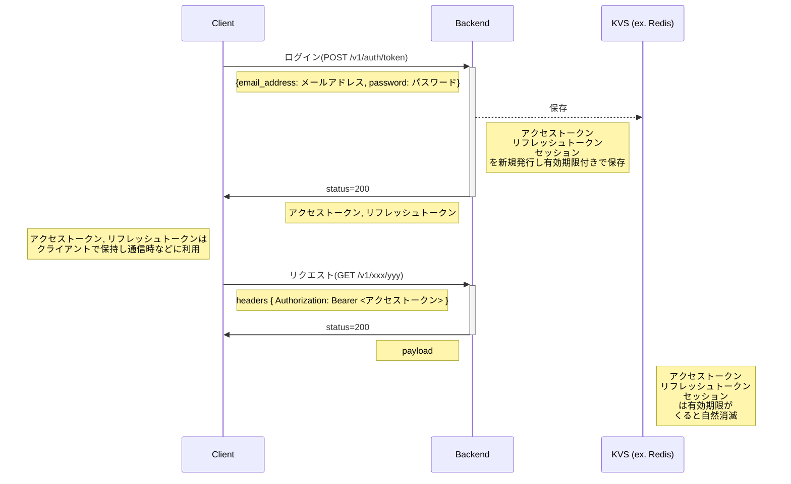
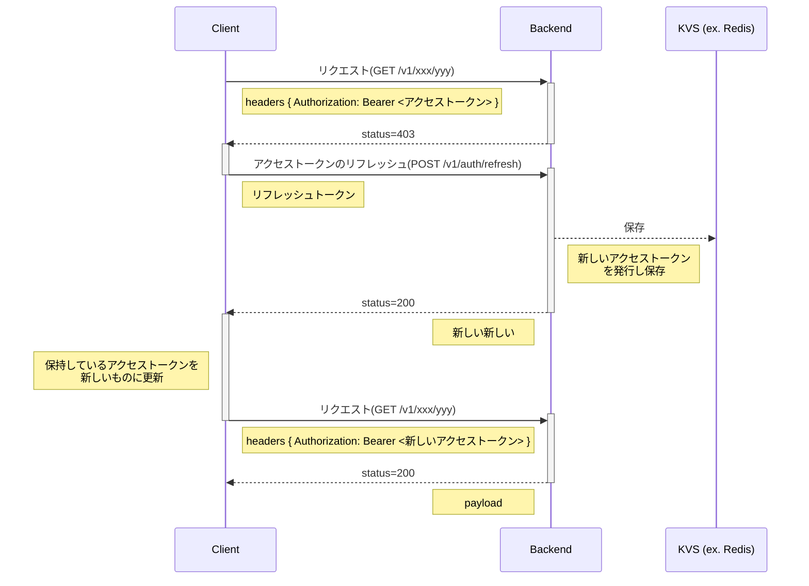
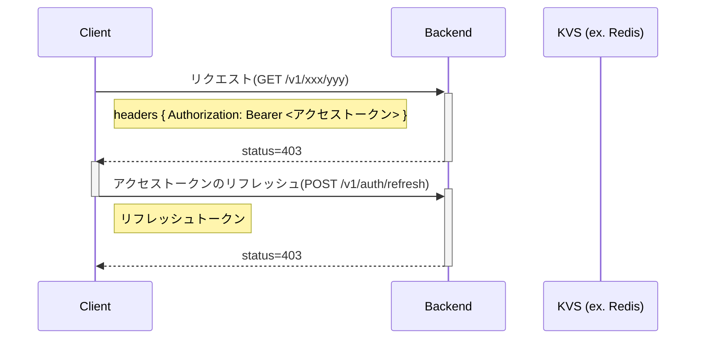
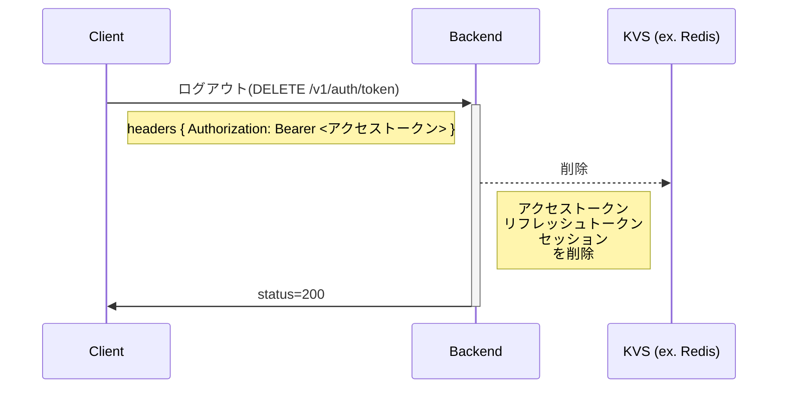

# 👤 ユーザー認証
バックエンドにおける認証は、リクエストヘッダーに付与される `Bearer` トークンを基に認証処理を行っています。

## 🔓トークンの発行(ログイン)
メアド/パスワードないしは、Google や GitHub など外部のサービスの認証情報指定で、 バックエンドがセッションを作成し、それに紐づくアクセストークンとリフレッシュトークンを発行します。
認証が必須な API エンドポイントにリクエストする場合は、HTTP リクエストの `Authorization` ヘッダーに `Bearer <アクセストークン|リフレッシュトークン>` を付与することで、認証処理がなされます。

## 🔐トークンのリフレッシュ

**アクセストークンの有効期限が切れているが、リフレッシュトークンは有効な場合**

**アクセストークン、リフレッシュトークンともに有効期限が切れている場合**

## 🔒トークンの破棄(ログアウト)

