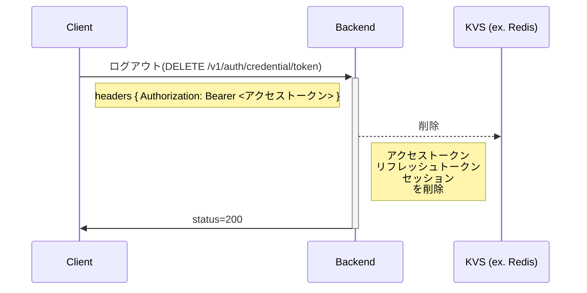

# 👤 ユーザー認証
バックエンドにおける認証は、リクエストヘッダーに付与される `Bearer` トークンを基に認証処理を行っています。

## 🔓トークンの発行(ログイン)
メアド/パスワードないしは、Google や GitHub など外部のサービスの認証情報指定で、 バックエンドがセッションを作成し、それに紐づくアクセストークンとリフレッシュトークンを発行します。
認証が必須な API エンドポイントにリクエストする場合は、HTTP リクエストの `Authorization` ヘッダーに `Bearer <アクセストークン|リフレッシュトークン>` を付与することで、認証処理がなされます。

```mermaid
sequenceDiagram
    participant C as Client
    participant B as Backend
    participant R as KVS (ex. Redis)

    C->>+B: ログイン(POST /v1/auth/credential/token)
    Note right of C: {email_address: メールアドレス, password: パスワード}
    B-->>R: 保存
    Note right of B: アクセストークン<br>リフレッシュトークン<br>セッション<br>を新規発行し有効期限付きで保存
    B->>-C: status=200
    Note left of B: アクセストークン, リフレッシュトークン
    Note left of C: アクセストークン, リフレッシュトークンは<br>クライアントで保持し通信時などに利用
    C->>+B: リクエスト(GET /v1/xxx/yyy)
    Note right of C: headers { Authorization: Bearer <アクセストークン> }
    b-->>-C: status=200
    Note left of B: payload
    Note right of R: access_token<br>refresh_token<br>session<br>は有効期限が<br>くると自然消滅
```

## 🔐トークンのリフレッシュ

**アクセストークンの有効期限が切れているが、リフレッシュトークンは有効な場合**

WIP

**アクセストークン、リフレッシュトークンともに有効期限が切れている場合**

WIP

## 🔒トークンの破棄(ログアウト)


