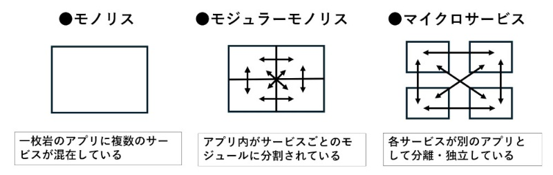

# 🏘 モジュラモノリス
本リポジトリのバックエンドでは、モジュラモノリスパターンを採用しています。

モジュラモノリスは、「モノリシックアーキテクチャ」と「モジュール性」を組み合わせたアーキテクチャパターンです。
従来のモノリシックアーキテクチャは一つの巨大なコードベースから成り立っていますが、モジュラモノリスでは、機能やドメインごとにモジュール化されており、各モジュールが独立して開発・テストが可能です。
しかし、これらのモジュールは一つのアプリケーションとして一緒にデプロイされます。

## 👉 モジュラモノリスの特徴

|        特徴        | 説明                                                                    |
|:----------------:|:----------------------------------------------------------------------|
|    **単一デプロイ**    | アプリケーション全体を一度にデプロイします。各モジュールが個別に独立していても、システム全体は一つのプロセスとして動作します。       |
|    **モジュール性**    | コードベースが機能別にモジュールとして分割されており、モジュールごとに責任範囲が明確です。これにより、開発やメンテナンスが容易になります。 |
| **パフォーマンスの一貫性**  | システムは一つのプロセス内で実行されるため、ネットワーク遅延や分散システムの複雑さがなく、モジュール間の通信は高速です。          |

## 🤔従来のモノリシックアーキテクチャ / マイクロサービスとの違い

モジュラモノリスと従来のモノリシックアーキテクチャでは以下の点で違います。

 - 従来のモノリスはすべてが密結合しているため、システム全体に影響を与えない形で一部の機能を修正することが難しいです。
 - モジュラモノリスでは、モジュール同士が明確に分離され、モジュール間の依存を最低限に抑えることで、部分的な修正や機能の追加がより簡単です。

また、モジュラモノリスとマイクロサービスは一見似ているように見えますが、いくつかの違いがあります。

|    違い    | 説明                                                                         |
|:--------:|:---------------------------------------------------------------------------|
| **デプロイ** | モジュラモノリスは一つのアプリケーションとしてデプロイされるのに対し、マイクロサービスは個々のサービスが独立してデプロイされます。          |
|  **通信**  | モジュラモノリスではモジュール間の通信が同一プロセス内で行われますが、マイクロサービスではサービス間の通信はネットワークを介して行われます。     |
| **運用負荷** | マイクロサービスは独立したサービスごとにスケーリングやモニタリングが必要なため、運用の複雑さが増します。モジュラモノリスはシンプルな運用が可能です。 |

## 🚀 モジュラモノリスのメリット/デメリット

**👍メリット**

|    👍 メリット     | 説明 |
|:-----------:|:----|
| **開発スピード**  | モジュールごとに責任が分かれているため、開発の分担がしやすく、変更の影響範囲も小さくなります。 |
| **シンプルな運用** | マイクロサービスと比べ、運用やデプロイの負荷が少なく、シンプルな運用が可能です。 |
| **パフォーマンス** | 同一プロセス内で動作するため、モジュール間の通信は高速で、パフォーマンスが安定しています。 |

**👎 デメリット**

|   👎 デメリット    | 説明 |
|:-------------:|:----|
| **スケーリングの制約** | 一部のモジュールだけを独立してスケールすることが難しいため、全体のスケーラビリティがマイクロサービスほど高くないことがあります。 |
|  **複雑化の可能性**  | アーキテクチャやモジュール設計が適切でない場合、結局はモジュール同士が依存し合い、モノリシックのデメリットを抱える可能性があります。 |

## 🎯 まとめ
モジュラモノリスは、モジュールごとに責任を分離しつつ、全体としてシンプルなデプロイや運用を保つアーキテクチャです。特に、マイクロサービスの複雑な運用を避けつつも、機能や開発のスケーラビリティを高めたい場合に適した選択肢です。
