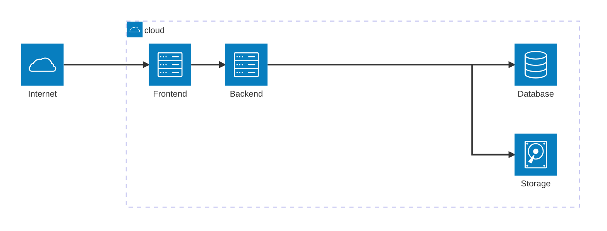

# 🛠️ システムアーキテクチャ
## 🛠️ フェーズ1 - 3層アーキテクチャ

**AWS**

**GCP**

WIP

## 🛠️ フェーズ2 - API Gateway アーキテクチャ
モジュラモノリス構成のバックエンドシステムから一部モジュールをマイクロサービス化するフェーズ。 
この場合、最低2つ以上のマイクロサービスが存在するため、フロントエンドは各マイクロサービスエンドポイントの呼び出しを数多く処理する必要があります。 
また、サービスが進化して、新しいマイクロサービスが導入されたり既存のマイクロサービスが変更されたりすると、フロントエンドは膨大な数のエンドポイントを処理するのが大変になります。

したがって、マイクロサービスへ移行するにあたり、フロントエンドとバックエンドの間に間接層の API Gateway を導入するのが良いです。

 - [API ゲートウェイ パターンと、クライアントからマイクロサービスへの直接通信との比較 - .NET | Microsoft Learn](https://learn.microsoft.com/ja-jp/dotnet/architecture/microservices/architect-microservice-container-applications/direct-client-to-microservice-communication-versus-the-api-gateway-pattern)

## 🛠️️ フェーズ3 - マイクロサービスアーキテクチャ

WIP